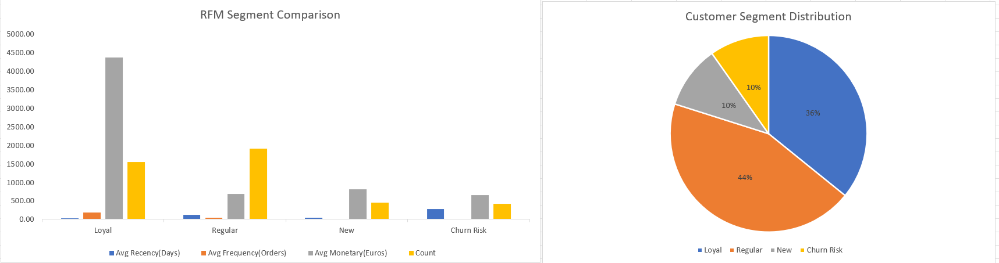
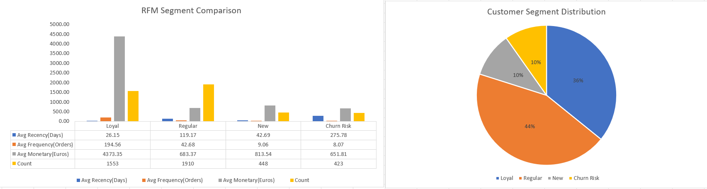

# Syntecxhub_Customer_Segmentation_rfm_Analysis
# Customer Segmentation Using RFM Analysis

Excel-based customer segmentation project using RFM (Recency, Frequency, Monetary) analysis on real e-commerce transaction data.

## Project Overview
RFM analysis is a customer segmentation technique that scores each customer on three behavioral dimensions:
- **Recency (R)** — How many days since the customer's last purchase
- **Frequency (F)** — How many separate orders the customer has placed
- **Monetary (M)** — How much the customer has spent in total

Each customer is scored 1–5 on each dimension and grouped into actionable segments (Loyal, Regular, New, Churn Risk) to guide targeted marketing decisions.

## Dataset
- **Source:** [E-Commerce Data](https://www.kaggle.com/datasets/carrie1/ecommerce-data) (Kaggle, by carrie1) — actual transactions from a UK-based online retailer
- **Raw size:** 541,909 rows × 8 columns
- **Time period:** December 2010 – December 2011
- **Fields:** InvoiceNo, StockCode, Description, Quantity, InvoiceDate, UnitPrice, CustomerID, Country

## Data Cleaning
Performed entirely in Excel:
1. Removed rows with missing CustomerID (guest checkouts, not trackable)
2. Removed cancelled orders (InvoiceNo starting with "C")
3. Removed rows with negative or zero Quantity/UnitPrice
4. Removed non-product stock codes (BANK CHARGES, POST, DOT, C2, M, blanks)
5. Removed full-row duplicate entries
6. Added a calculated `TotalPrice` column (Quantity × UnitPrice)
7. Formatted currency fields and corrected data types

**Result:** 541,909 → 391,151 clean transaction rows, covering 4,335 unique customers.

## RFM Calculation
1. Set a snapshot date (one day after the last transaction: **10 Dec 2011**) as the reference point for Recency
2. Built a PivotTable grouped by CustomerID to calculate:
   - Max InvoiceDate → converted to Recency (days since last order)
   - Count of InvoiceNo → Frequency
   - Sum of TotalPrice → Monetary
3. Scored each customer 1–5 on R, F, and M using quartile-based cutoffs derived from the actual data distribution (not fixed/generic thresholds), ensuring scores were meaningfully spread across the customer base
4. Combined scores into segment labels using nested logic on the R/F/M scores

## Customer Segments
| Segment | Customers | Avg Recency (days) | Avg Frequency (orders) | Avg Monetary (£) |
|---|---|---|---|---|
| Loyal | 1,553 (36%) | 26 | 195 | 4,373 |
| Regular | 1,910 (44%) | 119 | 43 | 683 |
| New | 448 (10%) | 43 | 9 | 814 |
| Churn Risk | 423 (10%) | 276 | 8 | 652 |

## Key Findings & Recommendations
**Loyal (1,553 customers)** — Order roughly every 2–4 weeks with the highest average order count by a wide margin, behaving more like repeat/bulk buyers than occasional shoppers. *Recommendation:* prioritize retention with a loyalty tier or bulk-order perk — this group is relatively small but drives disproportionate revenue.

**Regular (1,910 customers)** — The largest segment, but average recency (119 days) is notably worse than New customers despite having far more order history, suggesting many are past customers slowing down. *Recommendation:* a re-engagement nudge timed around the 90–100 day mark, before they drift into Churn Risk.

**New (448 customers)** — Despite a low order count, average spend (£814) exceeds Regular customers (£683), indicating meaningful first purchases rather than small trial orders. *Recommendation:* focus on converting them to a second/third order quickly with a reorder prompt.

**Churn Risk (423 customers)** — Average spend (£652) is close to Regular customers — this isn't a low-value segment, they simply stopped ordering roughly 9 months ago on average. *Recommendation:* a targeted win-back offer, justified by their prior spend history.

## Dashboard

.

## Tools Used
- Microsoft Excel — PivotTables, formulas (AVERAGEIF, COUNTIF, nested IF, QUARTILE), charts

## Files
- [Download the full Excel workbook](https://docs.google.com/spreadsheets/d/1j4Lo0kGzEla8RjSvrtKU3nTm-jCUse70/edit?usp=drive_link&ouid=106659109928251456947&rtpof=true&sd=true) — includes Clean_Data, RFM_Analysis, and Dashboard sheets

> **Note:** the full workbook exceeds GitHub's file size limit (25MB via web upload) due to the volume of cleaned transaction data (391,151 rows), so it's hosted on Google Drive and linked above instead of uploaded directly.
